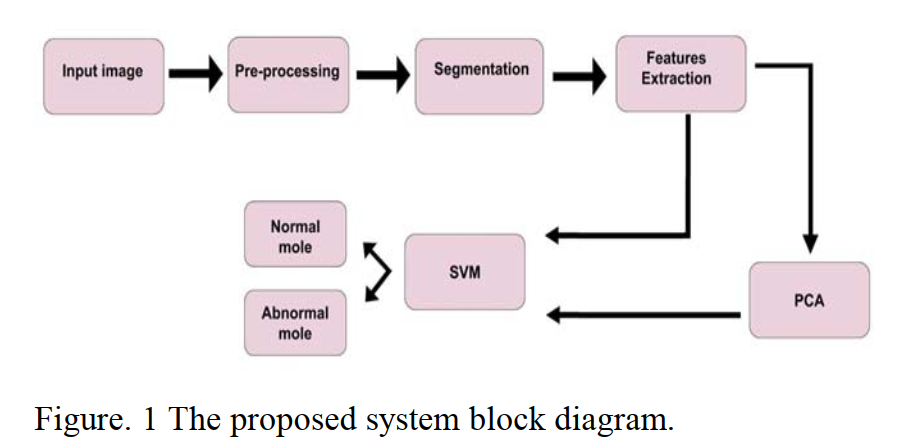
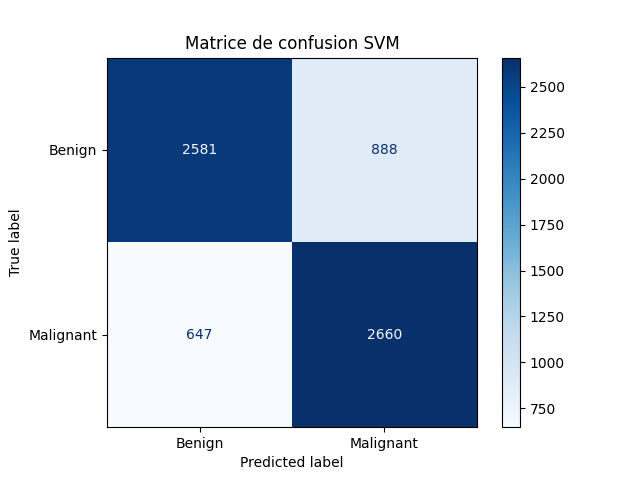
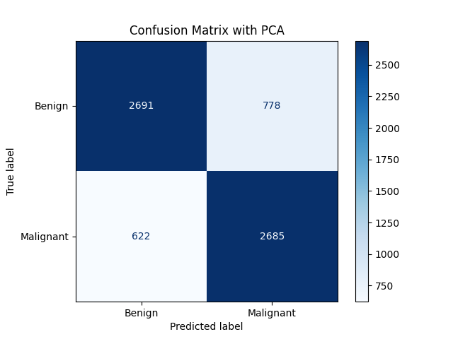

# Melanoma Skin Cancer Detection with Support Vector Machine (SVM)

## Project Overview
This project aims to develop an automated system to detect and classify melanoma skin cancer from dermoscopic images. Melanoma is the most aggressive form of skin cancer, and early detection is critical for effective treatment. Using machine learning techniques, this project applies Support Vector Machine (SVM) to classify skin lesions as benign or malignant based on image processing and feature extraction.

## Methodology
The project follows a structured workflow with the following steps:

1. **Image Preprocessing**: Images are converted to grayscale, with histogram adjustments and noise filtering to enhance contrast.
2. **Segmentation**: The Region of Interest (ROI) is segmented using Otsu thresholding, followed by filling and opening operations to isolate the lesion area.
3. **Feature Extraction**: Key features (texture, color, shape) are extracted from the segmented lesion using methods such as the Gray Level Co-occurrence Matrix (GLCM) and ABCD parameters (Asymmetry, Border, Color, Diameter).
4. **Dimensionality Reduction**: Principal Component Analysis (PCA) is used to select the most significant features.
5. **Classification**: An SVM classifier is trained to categorize lesions as benign or malignant based on the extracted features.

## Installation
To run this project, you need the following dependencies:
- Python (3.9+)
- Libraries: `opencv-python`, `numpy`, `scikit-learn`, `pandas`, `matplotlib`, `tensorflow`, `scipy`

## Usage
1. **Data Preparation**: Organize your image dataset with subfolders named "Benign" and "Malignant" within a main dataset folder.
2. **Run the Notebook**: Open and run each cell in the Jupyter notebook to execute the complete workflow, from data loading to classification.

## Results
The SVM classifier produces a classification report, accuracy score, and confusion matrix, providing insight into the model's performance on melanoma detection.

## References
Alquran, H., et al. (2017). *The Melanoma Skin Cancer Detection and Classification Using Support Vector Machine*. [ResearchGate Article](https://www.researchgate.net/publication/319289816_The_Melanoma_Skin_Cancer_Detection_and_Classification_Using_Support_Vector_Machine)
